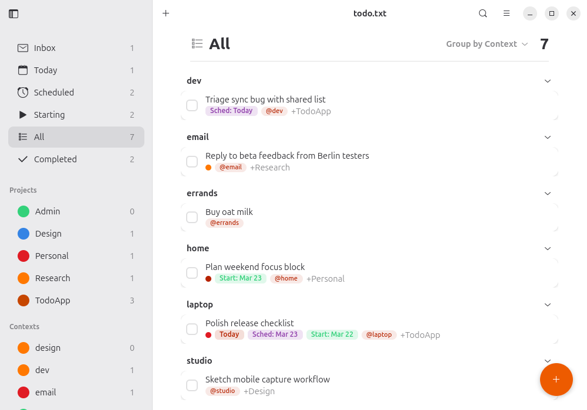
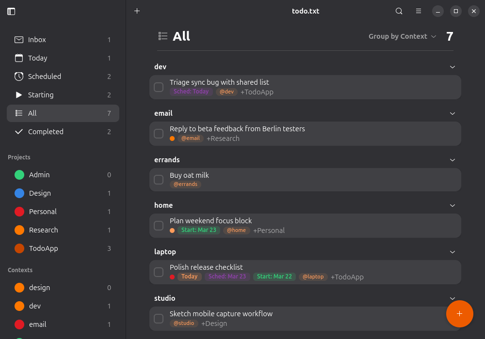
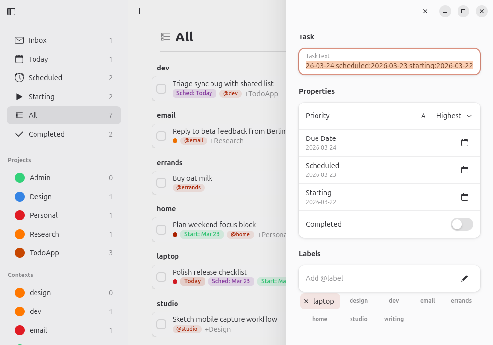
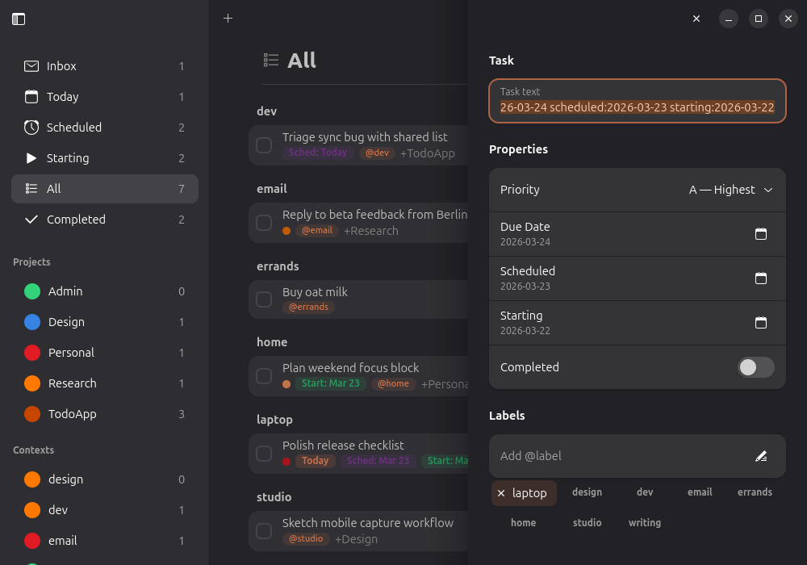
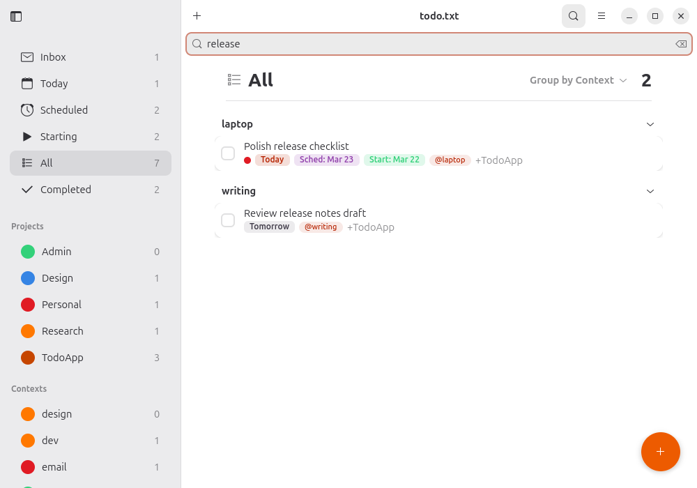
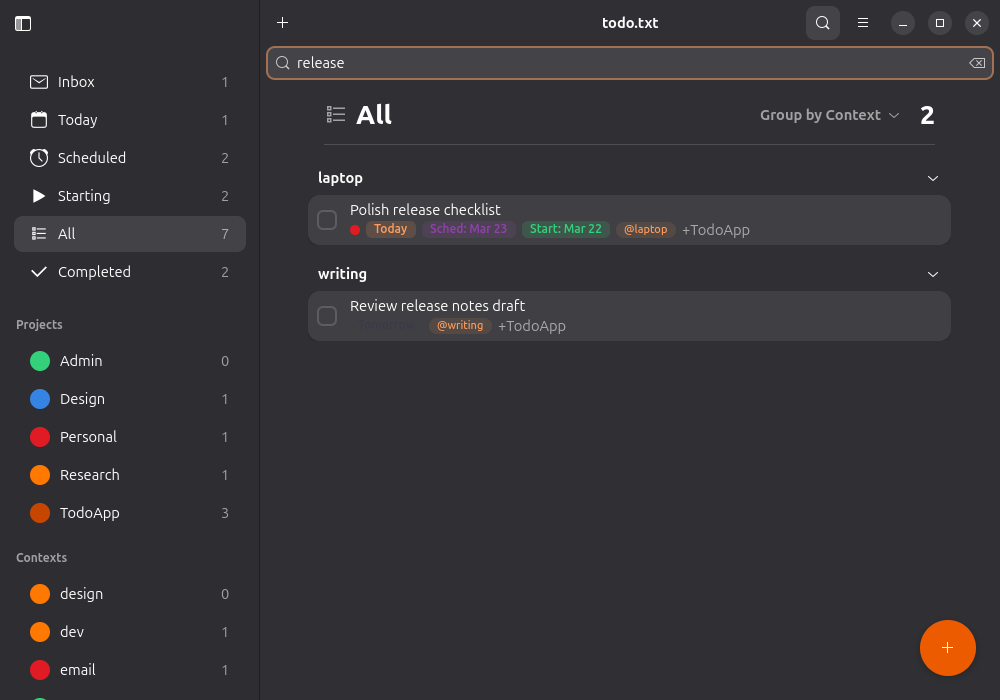

<p align="center">
  
</p>

<h1 align="center">Todo</h1>

A GTK4/libadwaita desktop application for managing todo.txt files.

This project targets GNOME on Wayland. X11 sessions are not supported.

> **Note:** This project is entirely vibe-coded (built with AI assistance).
> Because of that, it won't be published on Flathub — at least for now.

## Screenshots

| View | Light | Dark |
|------|-------|------|
| Overview |  |  |
| Detail panel |  |  |
| Search |  |  |

The gallery images are committed as static README assets.

## Installation

The recommended way to install is to install both the Flatpak app and the
GNOME Shell extension together:

```bash
git clone https://github.com/esatbayhan/gnome-todo.git
cd gnome-todo
./install.sh
```

This installs the GNOME SDK/runtime if needed, builds the app, installs it as a
user Flatpak, and installs/enables the GNOME Shell extension.

If you only want the app, run:

```bash
./install-flatpak.sh
```

If you only want to install or update the extension, run:

```bash
./install-extension.sh
```

For quicker extension development iterations, run:

```bash
./install-extension.sh --reload
./watch-extension.sh
```

You can then launch the app from your application menu or via:

```bash
flatpak run dev.bayhan.GnomeTodo
```

For day-to-day local rebuilds, `./install-flatpak.sh` reinstalls the app from
the current project sources while reusing cached dependency downloads. If you
want to refresh pinned sources such as `blueprint-compiler`, run
`./install-flatpak.sh --refresh-sources` or `./install.sh --refresh-sources`.

### Requirements for building

- `flatpak`
- `flatpak-builder`

On Ubuntu/Debian:

```bash
sudo apt install flatpak flatpak-builder
```

On Fedora:

```bash
sudo dnf install flatpak flatpak-builder
```

On Arch:

```bash
sudo pacman -S flatpak flatpak-builder
```

When adding or changing UI icon names, choose themed icons that exist in the
target Flatpak runtime (`org.gnome.Platform//49`), rather than assuming the
host distro theme provides the same set.

## Configuration

The application reads todo.txt files based on these environment variables,
checked in order:

| Variable | Purpose |
|---|---|
| `TODO_FILE` | Explicit path to `todo.txt` |
| `TODO_DIR` | Directory containing `todo.txt` and `done.txt` |

If neither is set, the application checks for a saved directory in
`~/.config/todotxt-gui/config.json`. On first launch (when no directory is
configured), a welcome dialog prompts the user to choose a task folder.
The directory can be changed later via **Preferences** in the hamburger menu.

## Keyboard shortcuts

| Shortcut | Action |
|----------|--------|
| Ctrl+N | New task |
| Ctrl+F | Search tasks |
| Escape | Close detail panel |
| Ctrl+1–6 | Switch smart filter (Inbox, Today, Scheduled, Starting, All, Completed) |
| F9 | Toggle sidebar |
| Ctrl+, | Preferences |
| Ctrl+? | Keyboard shortcuts |

## The todo.txt format

This app uses the [todo.txt format](https://github.com/todotxt/todo.txt) — a
simple, plain-text way to manage tasks. Each task is a single line in a text
file, with optional priorities, dates, projects (`+project`), and contexts
(`@context`).

## Project structure

```
meson.build                 Root Meson build definition
dev.bayhan.GnomeTodo.json   Flatpak manifest
install-flatpak.sh          One-command Flatpak build & install script

data/
    dev.bayhan.GnomeTodo.desktop      Desktop entry
    dev.bayhan.GnomeTodo.metainfo.xml AppStream metadata
    dev.bayhan.GnomeTodo.svg          Application icon
    meson.build                       Installs desktop data files

src/
    meson.build                       Compiles blueprints, bundles GResource,
                                      installs launcher and Python packages
    todogui.in                        Launcher script template
    dev.bayhan.GnomeTodo.gresource.xml
    style.css                         Custom styles

    ui/
        *.blp                         Blueprint UI definitions

    todotxt_gui/
        app.py              Application entry point and CSS loading
        _window.py          Main window (sidebar, content, detail split view)
        _content.py         Content header, task rows, task sections
        _content_header.py  Content pane header with grouping menu
        _detail_panel.py    Right-side task detail/edit panel
        _dialogs.py         Add-task dialog with property pickers
        _sidebar.py         Smart filter list and project/context lists
        _task_row.py        Rich two-line task row widget
        _widgets.py         Small reusable widget factories
        _grouping.py        Task grouping logic
        _config.py          Persistent JSON configuration
        _core.py            File path resolution
        _file_monitor.py    External file change detection
        _preferences.py     Preferences dialog
        _shortcuts.py       Keyboard shortcuts
        _welcome.py         First-launch welcome dialog
        _ui.py              GResource path constant

    todotxt_lib/
        parser.py           todo.txt line parser
        task.py             Task data model
        todo_file.py        File read/write operations
        operations.py       Task manipulation helpers
        env.py              Environment variable resolution

tests/
    lib/                    Unit tests for todotxt_lib
    gui/                    Unit tests for todotxt_gui
```

## Design principles

- **Native appearance.** The application uses libadwaita widgets and built-in
  CSS classes wherever possible. Custom CSS is limited to elements with no
  Adwaita equivalent: project circle colors, priority dots, due-date badges,
  context chips, and the FAB button.

- **Blueprint for layout, Python for logic.** Static widget trees are declared
  in `.blp` files. Dynamic content (task lists, filter counts, chip creation)
  is handled in Python.

- **Plain-text storage.** Your data lives in standard `todo.txt` and `done.txt`
  files — always portable, always yours.

- **Sync-friendly.** The todo.txt files are plain text and intended to be
  synced across devices using tools like Syncthing, Nextcloud, or similar.
  The application monitors the files for external changes and automatically
  reloads when they are modified outside the app.

## Contributing

Contributions are welcome! See [CONTRIBUTING.md](CONTRIBUTING.md) for
development setup and guidelines.

## License

[MIT](LICENSE) — Copyright (c) 2026 Esat Bayhan
